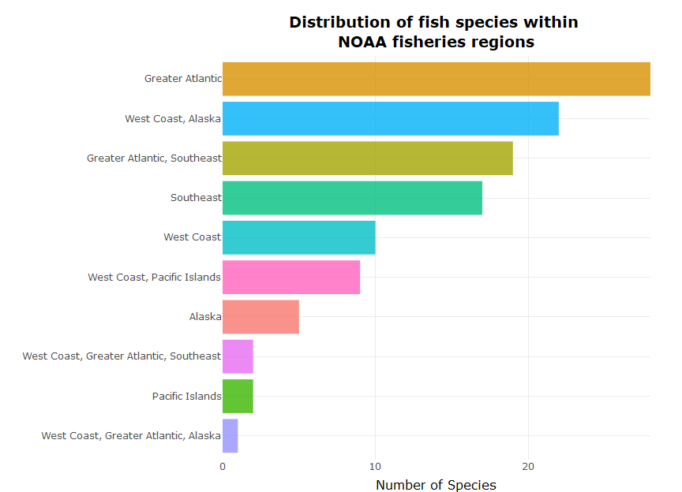
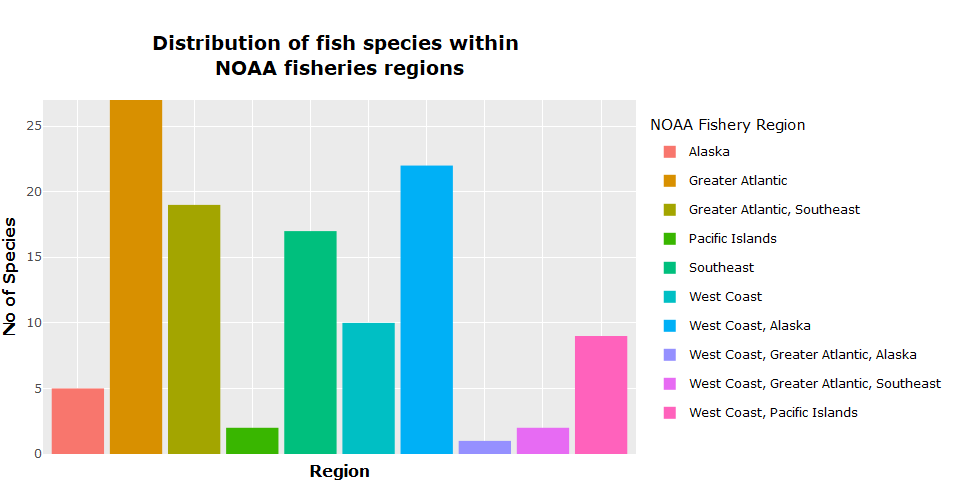

Fisheries
================
Fredrick Boshe
09/04/2021

# Seafood: The Ultimate Food 🐟?

As more people are opting against red meat diet for plant based and sea
food, this might be a good time to analyze aquatic food sources. The
[environmental
impact](https://www.greenpeace.org.uk/news/why-meat-is-bad-for-the-environment/#:~:text=It%20causes%20climate%20change,the%20atmosphere%2C%20accelerating%20global%20warming)
of industrialized red meat production and [health
concerns](https://www.nytimes.com/2019/09/30/health/red-meat-heart-cancer.html)
has made sea food a favourable alternative diet also termed as
[“pescatarian
diet”](https://www.medicalnewstoday.com/articles/323907#:~:text=What%20is%20a%20pescatarian%20diet%3F&text=In%20the%20pescatarian%20diet%2C%20a,and%20fish%20products%20may%20enhance).

This project looks to answer two thing:

1.  But is sea food environmentally sustainable?
2.  Does it pack the nutrients to replace red meat diet?

We shall be utilizing the fisheries management dataset from the
[National Oceanic and Atmostpheric Administration
(NOAA)](https://www.fishwatch.gov/resources). Accessing the latest data
using their **FishWatch API**.

This is my first time attempting to work with APIs to access data. A
learning curve.

#### Acessing the data

``` r
#Create a function to request the endpoint and receive a dataframe converted from JSON

fish<- function(endpoint) {
  url <- modify_url("https://www.fishwatch.gov", path = endpoint)
  response<-GET(url)
  
  #tracking status codes
  if(http_error(response)){
    print(status_code(response))
    stop("Something went wrong.", call. = FALSE)
  }
  
  if(http_type(response)!="application/json"){
    stop("API did not return json", call. = FALSE)
  }
  #Get content as text
  json_text<- content(response, as="text")
  dataframe<-fromJSON(json_text)
  return(dataframe)
  
}

fish.df<-as_tibble(flatten(fish("/api/species?format=json")))

#Remain with variables useful in the analysis
fish.df<-fish.df%>%
  select(2,7,8,12,14,17:19,26,29,32,33,36,41,45:47,
        49,51,56)
var_name<-data.frame(names(fish.df))
var_name<-var_name%>%
  rename(Variables=names.fish.df.)
```

We have reduced it to the essential variables we shall use to evaluate
some of the sea food being monitored by NOAA.

``` r
#The data contains html tags throughout the columns. Clean them out
cleanFun <- function(htmlString) {
  return(gsub("<.*?>", "", htmlString))
}
fish.df<-data.frame(map(fish.df, cleanFun))
```

### Fishing and impacts

``` r
#Categorize population(naive categorization using the first instance of the words "Above", "Unknown" and "Below")
fish.df<-fish.df%>%
  mutate(population=ifelse(str_detect(Population, "[Aa]bove"), "Above target", 
                    ifelse(str_detect(Population, "[Uu]nknown"), "Unknown",
                           ifelse(str_detect(Population, "[Bb]elow|Near"),"Below target", NA))))    
```

    ##     Population Species
    ## 1 Above target      72
    ## 2 Below target      21
    ## 3      Unknown      13

``` r
#Categorize their availability (Annual or seasonal)
fish.df<-fish.df%>%
  mutate(availability=ifelse(str_detect(Availability, "[Yy]ear-?round"), "Year round", "Seasonal"))    
```

    ##   Availability Species
    ## 1     Seasonal       6
    ## 2   Year round     108

For fish that are caught fresh in long periods of the year i.e. 6-8
months of the year, and are canned or frozen year long, are coded as
available year-round.

Fish that are caught on strict seasonal basis e.g. June to October,
together with fish that are sporadically caught i.e. Wreckfish, are
categorized as seasonal.

``` r
#Categorize the fishing rates
##regex to capture overfishing
rate_regex="i?(closed|prohibited|[Rr]educe(d)?|quota|(rates))"
fish.df<-fish.df%>%
  mutate(fishing_rate=ifelse(str_detect(Fishing.Rate, "[Rr]ecommended|Not"), "Stable",
                             ifelse(str_detect(Fishing.Rate,rate_regex),"Over", "Unknown"))) 
```

    ##   Fishing rate Species
    ## 1         Over      14
    ## 2       Stable      91
    ## 3      Unknown       1

How the fishing rates were coded:

1.  **Over**: This include species are experiencing a mandated reduced
    fishing, species that are in regions where authorities have
    implemented quotas or rates to protect populations or fishing is
    out-right closed. e.g Sardines
2.  **Stable**: This include species that that are being fished at
    “recommended levels” within the fishing regions during the
    compilation of this data. e.g. Lobster
3.  **Unknown**: This single observation is for the **California Market
    Squid** whose fishing rate and populations have not be estimated by
    NOAA.

<!-- end list -->

``` r
#Categorize the environmental impact of species
fish.df<-fish.df%>%
  mutate(env_effects=ifelse(str_detect(Environmental.Effects, "benefits"), "Net benefit",
                            ifelse(str_detect(Environmental.Effects, "state"), "Federal monitoring",
                                   "Unknown"))) 
```

    ##   Environmental Effects Species
    ## 1    Federal monitoring       2
    ## 2           Net benefit       6

Unfortunately, not all species have their environmental effects
recorded. Oysters, Mussels, Clams and Geoducks have been quoted to have
a “**net benefit** on the environment as they remove excess nutrients
and improve water quality”. Sugar kelp have the same benefits with the
additional carbon fixing where they turn carbon-dioxide into oxygen.

The Atlantic Salmon and Sablefish are being actively monitored by the
federal and state authorities to ensure their fishing have minimal
impact on the environment.

### Fish Nutrition

``` r
#Convert the columns to numeric and rename to carry their respective units
#Calories column to numeric 
fish.df$Calories<-parse_number(fish.df$Calories) 

#Carbohydrates
fish.df$Carbohydrate<-parse_number(fish.df$Carbohydrate) 
fish.df<-fish.df%>%
  rename("carbs (g/ser)" = Carbohydrate)

#Cholesterol
fish.df$Cholesterol<-parse_number(fish.df$Cholesterol) 
fish.df<-fish.df%>%
  rename("cholesterol (mg/ser)" = Cholesterol)

#Fat
fish.df$Fat..Total<-parse_number(fish.df$Fat..Total) 
fish.df<-fish.df%>%
  rename("fat (g/ser)" = Fat..Total)

#Fiber
##This column has one value in mg and the rest are in g
unique(fish.df$Fiber..Total.Dietary)
```

    ## [1] "0 g"   "0"     "1.3 g" "34 mg"

``` r
fish.df$Fiber..Total.Dietary<-parse_number(fish.df$Fiber..Total.Dietary)

##convert the mg value to g
fish.df$Fiber..Total.Dietary<-ifelse(fish.df$Fiber..Total.Dietary==34, 34/1000, fish.df$Fiber..Total.Dietary)
fish.df$Fiber..Total.Dietary<-round(fish.df$Fiber..Total.Dietary, 2)

fish.df<-fish.df%>%
  rename("fiber (g/ser)" = Fiber..Total.Dietary)

#Protein
fish.df$Protein <-parse_number(fish.df$Protein) 
fish.df<-fish.df%>%
  rename("protein (g/ser)" = Protein)

#Saturated fat
fish.df$Saturated.Fatty.Acids..Total <-parse_number(fish.df$Saturated.Fatty.Acids..Total )
fish.df$Saturated.Fatty.Acids..Total<-round(fish.df$Saturated.Fatty.Acids..Total, 2)
fish.df<-fish.df%>%
  rename("saturated fatty acids (g/ser)" = Saturated.Fatty.Acids..Total)

#Selenium
##Some values are in percentage of daily intake and some in mcg
unique(fish.df$Selenium)
```

    ##  [1] "44.1 mcg"         "44.8 mcg"         "41.4 mcg"         "63 mcg"          
    ##  [5] NA                 "36.5 mcg"         "110 mcg"          "32.1 mcg"        
    ##  [9] "52.6 mcg"         "44.6 mcg"         "38 mcg"           "48.1 mcg"        
    ## [13] "160% daily value" "22.2 mcg"         "36.5  mcg"        "32.7 mcg"        
    ## [17] "49 mcg"           "38.2 mcg"         "30.2 mcg"         "39 mcg"          
    ## [21] "46.2  mcg"        "40.3 mcg"         "36.4 mcg"         "34.6 mcg"        
    ## [25] "24.3 mcg"         "43.3 mcg"         "33.7 mcg"         "21.9 mcg"        
    ## [29] "33.1 mcg"

``` r
fish.df$Selenium <-parse_number(fish.df$Selenium) 
fish.df$Selenium<-ifelse(fish.df$Selenium==160, 55*1.6, fish.df$Selenium) #55 mcg is the USA daily intake for adults and children above 14.

fish.df<-fish.df%>%
  rename("selenium (mcg/ser)" = Selenium)

#Sodium
fish.df$Sodium <-parse_number(fish.df$Sodium) 
fish.df<-fish.df%>%
  rename("sodium (mg/ser)" = Sodium)

#Sugars
fish.df$Sugars..Total <-parse_number(fish.df$Sugars..Total) 
fish.df<-fish.df%>%
  rename("sugars (g/ser)" = Sugars..Total)

#Serving Weight
fish.df$Serving.Weight <-parse_number(fish.df$Serving.Weight) 
fish.df<-fish.df%>%
  rename("serving weights (g)" = Serving.Weight)
```

``` r
fig1<-fish.df%>%ggplot(aes(x=noaa.fisheries.region, fill=noaa.fisheries.region))+
  geom_bar()+
  theme(plot.title = element_text(color="black", size=14, face="bold",hjust = 0.5),
        axis.text.x = element_blank(),
        axis.ticks = element_blank(),
        legend.title = element_blank(),
        axis.title.x = element_text(color="black", size=12, face="bold"),
        axis.title.y = element_text(color="black", size=12, face="bold"))+
  scale_y_continuous(expand = c(0, 0))+
  labs(title = "Distribution of fish species within \nNOAA fisheries regions",
       x="Region",
       y="No of Species")

mrg <- list(l = 10, r = 40,
          b = 15, t = 100,
          pad = 0)

fig1<-ggplotly(fig1)%>%layout(margin=mrg)
fig1
```

<!-- -->

``` r
fig2<- ggplotly(fig1)%>% add_annotations( text="NOAA Fishery Region", xref="paper", yref="paper",
                  x=1.02, xanchor="left",
                  y=0.9, yanchor="bottom",    # Same y as legend below
                  legendtitle=TRUE, showarrow=FALSE ) %>%
  layout( legend=list(y=0.9, yanchor="top" ) )
fig2
```

<!-- -->
