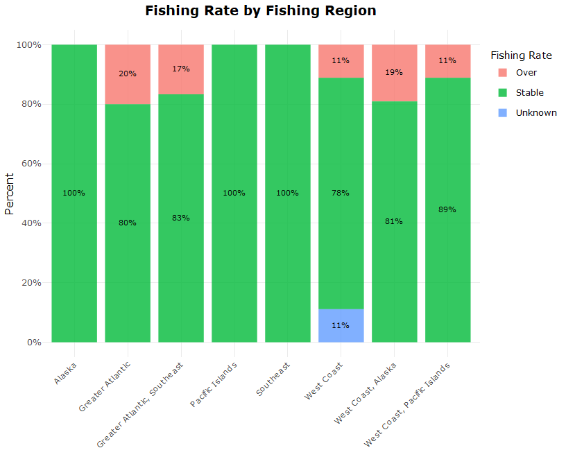
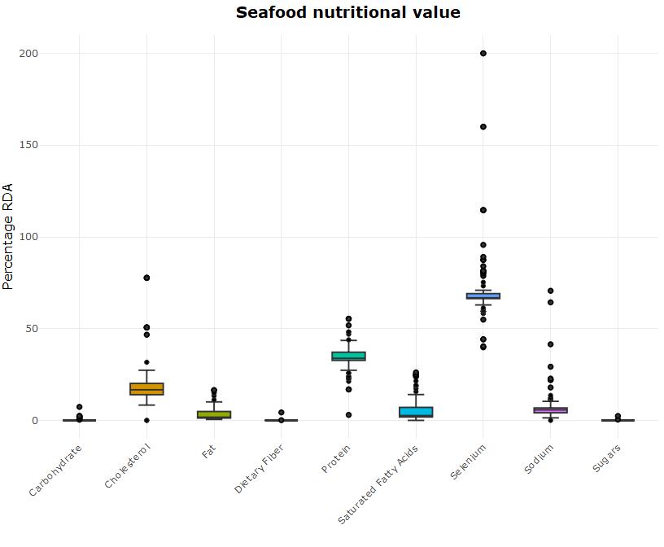
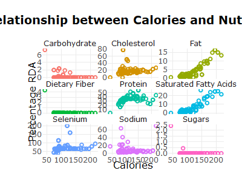
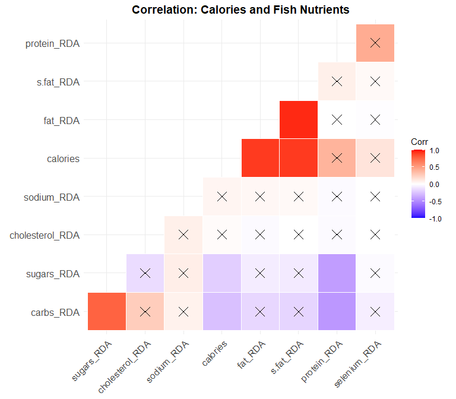
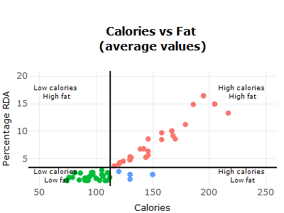
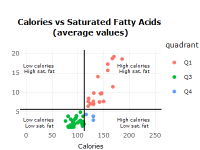
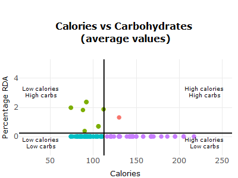
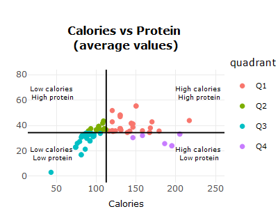
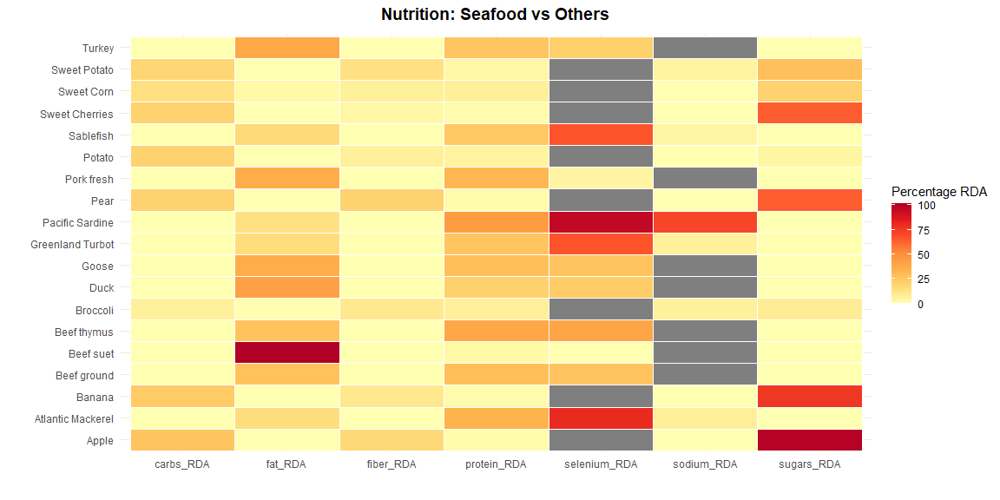
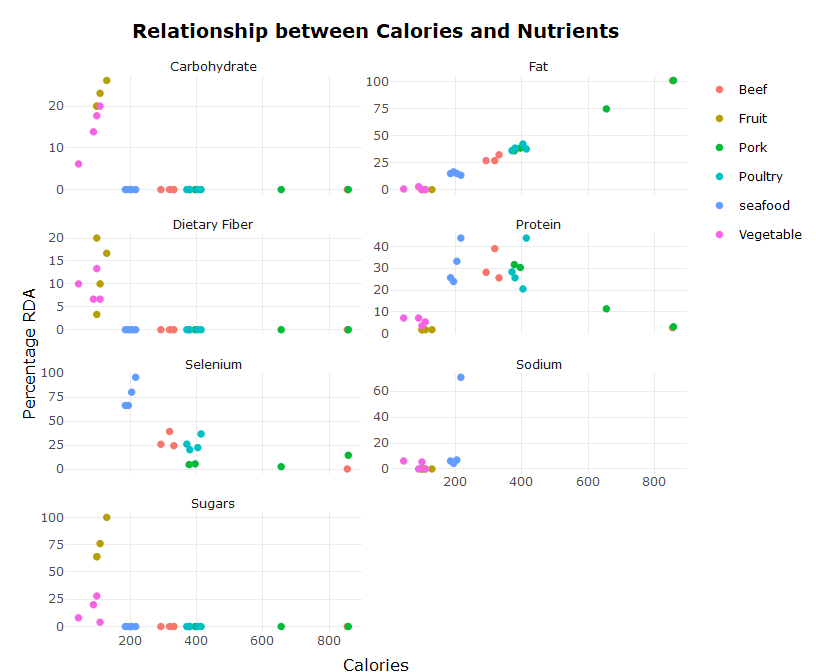

Fisheries
================
Fredrick Boshe
09/04/2021

<center>

# Seafood: The Ultimate Food 🐟?

</center>

As more people are opting against red meat diet for plant based and sea
food, this might be a good time to analyze aquatic food sources. The
[environmental
impact](https://www.greenpeace.org.uk/news/why-meat-is-bad-for-the-environment/#:~:text=It%20causes%20climate%20change,the%20atmosphere%2C%20accelerating%20global%20warming)
of industrialized red meat production and [health
concerns](https://www.nytimes.com/2019/09/30/health/red-meat-heart-cancer.html)
has made sea food a favourable alternative diet also termed as
[“pescatarian
diet”](https://www.medicalnewstoday.com/articles/323907#:~:text=What%20is%20a%20pescatarian%20diet%3F&text=In%20the%20pescatarian%20diet%2C%20a,and%20fish%20products%20may%20enhance).

Utilizing visualization, this project explores:

1.  Sustainability of seafood. **Goal:** Exploring how sustainable the
    fishing rates are across the fishing regions in USA. Environmentally
    and Fish populations.
2.  Nutritional value of seafood. **Goal:** Establishing the nutritional
    value of fish species found across US marine. Compare species,
    identify trends and comparison with other food sources e.g. beef.

This project primarily analyzes the fisheries management dataset from
the [National Oceanic and Atmostpheric Administration
(NOAA)](https://www.fishwatch.gov/resources). Accessing the latest data
using their **FishWatch API**.

If you are not familiar with pulling data using APIs, this project might
be helpful as this was alo my first attempt utilizing an API.

#### Acessing the data

``` r
#Create a function to request the endpoint and receive a dataframe converted from JSON
fish<- function(endpoint) {
  url <- modify_url("https://www.fishwatch.gov", path = endpoint)
  response<-GET(url)
  
  #tracking status codes
  if(http_error(response)){
    print(status_code(response))
    stop("Something went wrong.", call. = FALSE)
  }
  
  if(http_type(response)!="application/json"){
    stop("API did not return json", call. = FALSE)
  }
  #Get content as text
  json_text<- content(response, as="text")
  dataframe<-fromJSON(json_text)
  return(dataframe)
  
}

fish.df<-as_tibble(flatten(fish("/api/species?format=json")))

#Remain with variables useful in the analysis
fish.df<-fish.df%>%
  select(2,7,8,12,14,17:19,26,29,32,33,36,41,45:47,
        49,51,56)
var_name<-data.frame(names(fish.df))
var_name<-var_name%>%
  rename(Variables=names.fish.df.)
```

We have reduced it to the essential variables we shall use to evaluate
some of the seafood being monitored by NOAA.

Using REGEX function to parse througfh the coloumns to remove html tags
and make the data easier to sort through. This is the major first step
to cleaning the dataset.

``` r
#The data contains html tags throughout the columns. Clean them out
cleanFun <- function(htmlString) {
  return(gsub("<.*?>", "", htmlString))
}
fish.df<-data.frame(map(fish.df, cleanFun))
```

### Data Cleaning

#### Fishing Rates

``` r
#Categorize population(naive categorization using the first instance of the words "Above", "Unknown" and "Below")
fish.df<-fish.df%>%
  mutate(population=ifelse(str_detect(Population, "[Aa]bove"), "Above target", 
                    ifelse(str_detect(Population, "[Uu]nknown"), "Unknown",
                           ifelse(str_detect(Population, "[Bb]elow|Near"),"Below target", NA))))    
```

    ##     Population Species
    ## 1 Above target      72
    ## 2 Below target      22
    ## 3      Unknown      13

``` r
#Categorize their availability (Annual or seasonal)
fish.df<-fish.df%>%
  mutate(availability=ifelse(str_detect(Availability, "[Yy]ear-?round"), "Year round", "Seasonal"))    
```

    ##   Availability Species
    ## 1     Seasonal       6
    ## 2   Year round     109

For fish that are caught fresh in long periods of the year i.e. 6-8
months of the year, and are canned or frozen year long, are coded as
available **year-round**.

Fish that are caught on strict seasonal basis e.g. June to October,
together with fish that are sporadically caught i.e. Wreckfish, are
categorized as **seasonal**.

``` r
#Categorize the fishing rates
##regex to capture overfishing
rate_regex="i?(closed|prohibited|[Rr]educe(d)?|quota|(rates))"
fish.df<-fish.df%>%
  mutate(fishing_rate=ifelse(str_detect(Fishing.Rate, "[Rr]ecommended|Not"), "Stable",
                             ifelse(str_detect(Fishing.Rate,rate_regex),"Over", "Unknown"))) 
```

    ##   Fishing rate Species
    ## 1         Over      14
    ## 2       Stable      92
    ## 3      Unknown       1

How the fishing rates were coded:

1.  **Over**: This include species are experiencing a mandated reduced
    fishing, species that are in regions where authorities have
    implemented quotas or rates to protect populations or fishing is
    out-right closed. e.g Sardines
2.  **Stable**: This include species that that are being fished at
    “recommended levels” within the fishing regions during the
    compilation of this data. e.g. Lobster
3.  **Unknown**: This single observation is for the **California Market
    Squid** whose fishing rate and populations have not be estimated by
    NOAA.

``` r
#Categorize the environmental impact of species
fish.df<-fish.df%>%
  mutate(env_effects=ifelse(str_detect(Environmental.Effects, "benefits"), "Net benefit",
                            ifelse(str_detect(Environmental.Effects, "state"), 
                                   "Federal monitoring","Unknown"))) 
```

    ##   Environmental Effects Species
    ## 1    Federal monitoring       2
    ## 2           Net benefit       6

Unfortunately, not all species have their environmental effects
recorded. Oysters, Mussels, Clams and Geoducks have been quoted to have
a “**net benefit** on the environment as they remove excess nutrients
and improve water quality”. Sugar kelp have the same benefits with the
additional carbon fixing where they turn carbon-dioxide into oxygen.

The Atlantic Salmon and Sablefish are being actively monitored by the
federal and state authorities to ensure their fishing have minimal
impact on the environment.

#### Fish Nutrition

``` r
#Convert the columns to numeric and rename to carry their respective units
#Calories column to numeric 
fish.df$Calories<-parse_number(fish.df$Calories) 

#Carbohydrates
fish.df$Carbohydrate<-parse_number(fish.df$Carbohydrate) 
fish.df<-fish.df%>%
  rename("carbs (g/ser)" = Carbohydrate)

#Cholesterol
fish.df$Cholesterol<-parse_number(fish.df$Cholesterol) 
fish.df<-fish.df%>%
  rename("cholesterol (mg/ser)" = Cholesterol)

#Fat
fish.df$Fat..Total<-parse_number(fish.df$Fat..Total) 
fish.df<-fish.df%>%
  rename("fat (g/ser)" = Fat..Total)

#Fiber
##This column has one value in mg and the rest are in g
#unique(fish.df$Fiber..Total.Dietary)
fish.df$Fiber..Total.Dietary<-parse_number(fish.df$Fiber..Total.Dietary)

##convert the mg value to g
fish.df$Fiber..Total.Dietary<-ifelse(fish.df$Fiber..Total.Dietary==34, 34/1000, fish.df$Fiber..Total.Dietary)
fish.df$Fiber..Total.Dietary<-round(fish.df$Fiber..Total.Dietary, 2)

fish.df<-fish.df%>%
  rename("fiber (g/ser)" = Fiber..Total.Dietary)

#Protein
fish.df$Protein <-parse_number(fish.df$Protein) 
fish.df<-fish.df%>%
  rename("protein (g/ser)" = Protein)

#Saturated fat
fish.df$Saturated.Fatty.Acids..Total <-parse_number(fish.df$Saturated.Fatty.Acids..Total )
fish.df$Saturated.Fatty.Acids..Total<-round(fish.df$Saturated.Fatty.Acids..Total, 2)
fish.df<-fish.df%>%
  rename("saturated fatty acids (g/ser)" = Saturated.Fatty.Acids..Total)

#Selenium
##Some values are in percentage of daily intake and some in mcg
#unique(fish.df$Selenium)
fish.df$Selenium <-parse_number(fish.df$Selenium) 
fish.df$Selenium<-ifelse(fish.df$Selenium==160, 55*1.6, fish.df$Selenium) #55 mcg is the USA daily intake for adults and children above 14.

fish.df<-fish.df%>%
  rename("selenium (mcg/ser)" = Selenium)

#Sodium
fish.df$Sodium <-parse_number(fish.df$Sodium) 
fish.df<-fish.df%>%
  rename("sodium (mg/ser)" = Sodium)

#Sugars
fish.df$Sugars..Total <-parse_number(fish.df$Sugars..Total) 
fish.df<-fish.df%>%
  rename("sugars (g/ser)" = Sugars..Total)

#Serving Weight
fish.df$Serving.Weight <-parse_number(fish.df$Serving.Weight) 
fish.df<-fish.df%>%
  rename("serving weights (g)" = Serving.Weight)
```

### Analysis: Environmental Impact

#### Regional Fishing

``` r
fig1<-fish.df%>%
  count(noaa.fisheries.region)%>%
  ggplot(aes(x=reorder(noaa.fisheries.region, n), y = n, 
             fill=noaa.fisheries.region))+
  geom_bar(stat = "identity")+
  theme_minimal()+
  theme(plot.title = element_text(color="black", size=14, 
                                  face="bold", hjust = 0.5),
        axis.ticks = element_blank(),
        axis.title.x = element_text(color="black", size=12),
        axis.title.y = element_blank(),
        legend.position = "none")+
  scale_y_continuous(expand = c(0, 0))+
  coord_flip() +
  geom_col(alpha = 0.8, width = 0.85) +
  labs(title = "Distribution of fish species within \nNOAA fisheries regions",
       x="Region",
       y="Number of Species")

mrg <- list(l = 10, r = 40,
          b = 15, t = 70,
          pad = 0)

#ggplotly allows for an interactive chart
fig1<-ggplotly(fig1)%>%
  layout(margin=mrg)%>%
  style(hoverinfo = 'none')

fig1
```


<br></br> The most species are found in the Greater Atlantic area while
the least are found in the Pacific Island fishery region.

This means chances are, most of the fish people consume in the US comes
from the Greater Atlantic area! But does this mean the region is subject
to over fishing?

#### Regional Fishing Rates

We can examine how the fishing rates are in every region in the US. The
goal is to identify regions that are experiencing over fishing or are
within recommended fishing levels.

``` r
#Availability vs Fishing rate
plotdata <- fish.df%>%
  drop_na(fishing_rate)%>%
  group_by(noaa.fisheries.region, fishing_rate)%>%
  summarize(n = n())%>% 
  mutate(pct = n/sum(n),
         lbl = scales::percent(pct))

fig2<-plotdata%>%
  ggplot(aes(x=noaa.fisheries.region, y=pct, fill=fishing_rate))+
  geom_bar(stat = "identity", position = "fill")+
  theme_minimal()+
  theme(plot.title = element_text(color="black", size=14, 
                                  face="bold", hjust = 0.5),
        axis.ticks = element_blank(),
        legend.title = element_blank(),
        axis.title.x = element_text(color="black", size=12, face="bold"),
        axis.title.y = element_text(color="black", size=12))+
  scale_y_continuous(breaks = seq(0, 1, .2),label = percent)+
  geom_text(aes(label = lbl), size = 3, 
            position = position_stack(vjust = 0.5))+
  geom_col(alpha = 0.8, width = 0.85) +
  labs(title = "Fishing Rate by Fishing Region",
       x="",
       y="Percent")

#Plotly to make the chart more interactive
fig2<- ggplotly(fig2)%>% add_annotations( text="Fishing Rate", 
                                            xref="paper", yref="paper",
                                            x=1.02, xanchor="left",
                                            y=0.9, yanchor="bottom",
                                            legendtitle=TRUE, showarrow=FALSE )%>%
  layout(legend=list(y=0.9, yanchor="top"),xaxis=list(tickangle=-45))%>%
  style(hoverinfo = 'none')

fig2
```



The majority of fishing regions are experiencing stable fishing rates,
well within recommended levels for existing populations. The Greater
Atlantic fishing zone has the highest levels of over fishing as compared
to the other regions (20%).

<br></br>

|                                                         Blue Mussel                                                         |                                                                                                                             Sable Fish                                                                                                                             |
|:---------------------------------------------------------------------------------------------------------------------------:|:------------------------------------------------------------------------------------------------------------------------------------------------------------------------------------------------------------------------------------------------------------------:|
|        |                                                                                                                                   |
| The blue mussel has been observed to have a net benefit on the environment while boasting rich levels of protein (21% RDA). | The sable fish is available year round and is a great source for protein (24% RDA), low on carbs (0% RDA) and sodium (4% RDA). But the species is under monitoring from federal and state authorities to ensure its fishing has minimal impact on the environment. |

<br></br>

According to
[research](https://www.imas.utas.edu.au/news/news-items/beef,-lamb,-lobster-or-fish-fisheries-study-shows-impact-of-food-choice-on-carbon-emissions#:~:text=lobster%20or%20fish%3F-,Fisheries%20study%20shows%20impact%20of%20food%20choice%20on%20carbon%20emissions,alternatives%20like%20beef%20or%20lamb.)
from Canadian scientists, seafood has one of the lowest carbon footprint
as compared to other food sources. It is estimated that in the US, each
kilo of fish resulted in 1.6 kilos of carbon. Meanwhile, the
environmental cost of red meat such as beef and lamb, which is estimated
to range from 50 kilos to as much as 750 kilos of carbon per kilo of
meat.


<br></br>

Seafood is inherently more environmentally friendly as compared to red
meat. Its fishing levels, according to NOAA in the US, are well within
recommended levels allowing fish populations to sustainably thrive.

### Analysis: Nutritional Value

#### Seafood Nutrition

``` r
#Using the RDA information from US Dietary guidelines. 
#a) Dietary guidelines as a percentage of food calories
fish.df<-fish.df%>%
  mutate(fat_RDA=`fat (g/ser)`*100/93,
         s.fat_RDA=`saturated fatty acids (g/ser)`*100/13,
         carbs_RDA=`carbs (g/ser)`*100/130,
         sugars_RDA=`sugars (g/ser)`*100/25,
         protein_RDA=`protein (g/ser)`*100/56,
         cholesterol_RDA=`cholesterol (mg/ser)`*100/300,
         fiber_RDA=`fiber (g/ser)`*100/30,
         sodium_RDA=`sodium (mg/ser)`*100/1300,
         selenium_RDA=`selenium (mcg/ser)`*100/55)

fish.df<-fish.df %>% 
  mutate_at(vars(ends_with("RDA")), funs(round(., 2)))
```

``` r
fish_longer<-fish.df%>%
  pivot_longer(cols = c(fat_RDA, s.fat_RDA, carbs_RDA, sugars_RDA, protein_RDA,
                        cholesterol_RDA, fiber_RDA, sodium_RDA, selenium_RDA),
               names_to="nutrient",
               values_to="percent")

fig3<-fish_longer%>%ggplot(aes(x=nutrient, y=percent, fill=nutrient))+
  geom_boxplot()+
  theme_minimal()+
  theme(plot.title = element_text(color="black", size=14, 
                                  face="bold", hjust = 0.5),
        axis.text.x = element_text(angle = 45,),
        axis.ticks = element_blank(),
        legend.title = element_blank(),
        axis.title.x = element_blank(),
        axis.title.y = element_text(color="black", size=12),
        legend.position = "none")+
  labs(title="Seafood nutritional value",
       x= "Nutrient",
       y= "Percentage RDA")+
  scale_x_discrete(breaks=c("carbs_RDA","cholesterol_RDA","fat_RDA","fiber_RDA",
                            "protein_RDA", "s.fat_RDA","selenium_RDA", 
                            "sodium_RDA","sugars_RDA" ),
                   labels=c("Carbohydrate", "Cholesterol", "Fat", "Dietary Fiber", 
                            "Protein","Saturated Fatty Acids", "Selenium",
                            "Sodium", "Sugars"))

fig3<-ggplotly(fig3)
fig3
```



It looks like most fish species are rich in protein, selenium and
cholesterol. With the exception of Atlantic Bigeye Tuna and Pacific Blue
Marin, all fish species have nutrients that are within the recommended
dietary allowance in the USA.

All species show very low amounts of sugars, fat and saturated fatty
acids, which is good for heart health. For anyone looking for a low carb
diet, fish is the answer. They have very low carbohydrate per serving.

``` r
#Trend of fish calories and their nutrients
nut.labs<-c("Fat", "Saturated Fatty Acids", "Carbohydrate", "Sugars",
            "Protein", "Cholesterol", "Dietary Fiber", "Sodium", "Selenium")
names(nut.labs)<-c("fat_RDA", "s.fat_RDA", "carbs_RDA", "sugars_RDA", "protein_RDA",
                    "cholesterol_RDA", "fiber_RDA", "sodium_RDA", "selenium_RDA")

fig6<-fish_longer%>%ggplot(aes(x=calories, y=percent, color=nutrient, group=species))+
  geom_point(shape=1)+
  theme_minimal()+
  theme(plot.title = element_text(color="black", size=14, face="bold",hjust = 0.5),
        legend.title = element_blank(),
        axis.title.x = element_text(color="black", size=12),
        axis.title.y = element_text(color="black", size=12),
        panel.spacing.y = unit(1, "lines"))+
    labs(title="Relationship between Calories and Nutrients",
       x= "Calories",
       y= "Percentage RDA")+
  facet_wrap(~nutrient, labeller = labeller(nutrient=nut.labs),
             scales="free_y")

#Plotly tends to mess up axis titles from ggplots. One might have to tweak around the margins to get the perfect layout
fig6<- ggplotly(fig6, tooltip = c("species"))%>%
  hide_legend()


#This helps find out how plotly has listed the annotations
#str(fig6[['x']][['layout']][['annotations']]) 

#Locates the x position of the yaxis titles
#fig6[['x']][['layout']][['annotations']][[2]][['x']]

#move the y-axis title more left and x-axis title lower
fig6[['x']][['layout']][['annotations']][[2]][['x']] <- -0.05
fig6[['x']][['layout']][['annotations']][[1]][['y']] <- -0.04
fig6 %>% layout(margin = list(l = 65, t=75))
```



It would appear that the calories of fish have weak negative
relationship with the amount of carbohydrates and sugars. While there is
no significant relationship between fish calories with dietary fibers,
cholesterol and selenium. But there is a strong relationship between
fish calories and fat (r = 0.91), saturated fat (r = 0.90) and protein
(r = 0.39).

So for people trying to avoid fat and saturated fatty acids, fish might
not be the ideal dish for you. But for protein loading gym enthusiasts?
seafood is a good snack.



<br></br>

#### Comperative Quadrant

Looking at the four significant nutrients found in seafood i.e. fat,
saturated fats, carbohydrates and protein, cholesterol, i utilized
quadrants to group seafood in 4 groups based on their average
nutritional value.

``` r
#fat
cal_mean<-mean(fish.df$calories, na.rm = TRUE)
f.per_mean<-mean(fish.df$fat_RDA, na.rm = TRUE)

fig8<-fish.df%>%
  mutate(quadrant = case_when(calories > cal_mean & fat_RDA > f.per_mean ~ "Q1",
                              calories <= cal_mean & fat_RDA > f.per_mean ~ "Q2",
                              calories <= cal_mean& fat_RDA <= f.per_mean ~ "Q3",
                              TRUE                                         ~ "Q4"))%>%
  ggplot(aes(x=calories, y=fat_RDA, color= quadrant, group=species)) +
  geom_point() +
  lims(x=c(50,250),y=c(1,20)) +
  theme_minimal()+
  theme(plot.title = element_text(color="black", size=12, face="bold",
                                          hjust = 0.5),
        axis.title.x = element_text(color="black", size=10),
        axis.title.y = element_text(color="black", size=10),
        legend.position = "none")+
  labs(title="Calories vs Fat \n(average values)",
       x= "Calories",
       y= "Percentage RDA") +
  geom_vline(xintercept = cal_mean) + 
  geom_hline(yintercept = f.per_mean)+
  annotate("text", x=65, y=1.7, label= "Low calories \nLow fat", size=2.5) + 
  annotate("text", x =65, y=17, label = "Low calories \nHigh fat", size=2.5)+
  annotate("text", x=230, y=1.7, label= "High calories \nLow fat", size=2.5) + 
  annotate("text", x =230, y=17, label = "High calories \nHigh fat", size=2.5)

mrg3 <- list(l = 10, r = 10,
          b = 10, t = 100,
          pad = 0)

fig8<- ggplotly(fig8, tooltip = "species")%>% #the tooltip allows highlighting of species
  layout(margin=mrg3)

#S.fat
cal_mean<-mean(fish.df$calories, na.rm = TRUE)
sf.per_mean<-mean(fish.df$s.fat_RDA, na.rm = TRUE)

fig9<-fish.df%>%
  mutate(quadrant = case_when(calories > cal_mean & s.fat_RDA > sf.per_mean ~ "Q1",
                              calories <= cal_mean & s.fat_RDA > sf.per_mean~ "Q2",
                              calories <= cal_mean & s.fat_RDA <= sf.per_mean ~ "Q3",
                              TRUE                            ~ "Q4"))%>%
  ggplot(aes(x=calories, y=s.fat_RDA, color= quadrant, group=species)) +
  geom_point() +
  lims(x=c(0,250),y=c(1,20)) +
  theme_minimal()+
  theme(plot.title = element_text(color="black", size=12, face="bold",
                                          hjust = 0.5),
        axis.title.x = element_text(color="black", size=10),
        axis.title.y = element_text(color="black", size=10),
        legend.text=element_text(size=8))+
  labs(title="Calories vs Saturated Fatty Acids \n(average values)",
       x= "Calories",
       y= "") +
  geom_vline(xintercept = cal_mean) + 
  geom_hline(yintercept = sf.per_mean)+
  annotate("text", x=25, y=2, label= "Low calories \nLow sat. fat", size=2.5) + 
  annotate("text", x =25, y=16, label = "Low calories \nHigh sat. fat", size=2.5)+
  annotate("text", x=210, y=2, label= "High calories \nLow sat. fat", size=2.5) + 
  annotate("text", x =210, y=16, label = "High calories \nHigh sat. fat", size=2.5)

mrg3 <- list(l = 10, r = 10,
          b = 10, t = 100,
          pad = 0)

fig9<- ggplotly(fig9, tooltip = "species")%>%
  layout(margin=mrg3)
#Repeat this for any nutrient of interest
```





Above graphs depict a **nutritional value quadrant** for the fish
species found within the NOAA region. For all intents and purposes, the
species found in **quadrant 1** in each graph have the best value for
calories and their respective nutritional component.

As human diet differ across communities, some might be looking for
different levels of nutrients. It is important to be aware of how
calories relate to your diet of choice. Also to debunk any misguided
information one might have had prior.

<br></br>

## Analysis: Seafood vs Other Food Sources

To be able to compare against other food sources, we have to bring in
data from other online sources.

### Vegetables

Accessing [vegetable food nutrition
data](https://data.world/adamhelsinger/food-nutrition-information/workspace/file?filename=NutritionalFacts_Fruit_Vegetables_Seafood.csv)
data from data.world. You can download the whole CSV file and clean it
on R, but i prefer querying (SQL) the data i need on data.world and only
downloading parts that i need.

``` sql
--SQL Code to only get top 4 vegetables by calories
SELECT * 
FROM nutritionalfacts_fruit_vegetables_seafood
WHERE food_type LIKE "%vegetables%"
ORDER BY calories DESC
LIMIT 4;
```

### Fruits

``` sql
--SQL Code to only get top 4 vegetables by calories
SELECT * 
FROM nutritionalfacts_fruit_vegetables_seafood
WHERE food_type LIKE "%fruits%"
ORDER BY calories DESC
LIMIT 4;
```

For Animal nutrition information, i collected information from the [USDA
National Nutrient
Database](https://data.world/craigkelly/usda-national-nutrient-db).

### Beef

``` sql
--SQL Code to only get top 4 beef by calories
SELECT * 
FROM nndb_flat 
WHERE foodgroup LIKE "%beef%" AND shortdescrip LIKE "%meat%"
ORDER BY energy_kcal DESC
LIMIT 4;
```

### Pork

``` sql
--SQL Code to only get top 4 pork products by calories
SELECT * 
FROM nndb_flat 
WHERE foodgroup LIKE "%pork%" AND shortdescrip LIKE "%meat%"
ORDER BY energy_kcal DESC
LIMIT 4;
```

### Poultry

``` sql
--SQL Code to only get top 4 poultry products by calories
SELECT * 
FROM nndb_flat 
WHERE foodgroup LIKE "%poultry%" AND shortdescrip LIKE "%meat%"
ORDER BY energy_kcal DESC
LIMIT 4;
```

Import the trimmed data and finish manipulating the values. Finally
subset a dataset that will contain 4 different fruits, vegetables,
seafood and data on beef, pork, and poultry.

The goal is to have comparable values. I selected fruits and vegetables
with the highest calories. This will be the same with the fish species
selected. There is substantial cleaning, re-arranging, renaming and
binding dataframes. thankfully, dplyr and tidyverse have all the tools
for this.

``` r
#Convert their nutritional values to RDA
nutrition<-nutrition%>%
  mutate(fat_RDA=fat_g*100/93,
         carbs_RDA=carb_g*100/130,
         sugars_RDA=sugar_g*100/25,
         protein_RDA=protein_g*100/56,
         fiber_RDA=fiber_g*100/30,
         sodium_RDA=sodium_g*100/1300,
         selenium_RDA=selenium_mcg*100/55)

nutrition<-nutrition %>% 
  mutate_at(vars(ends_with("RDA")), funs(round(., 2)))

nutrition_longer<-nutrition%>%
  pivot_longer(cols = c(12:18),
               names_to = "nutrient",
               values_to = "value")

fig12<-nutrition_longer%>%
  ggplot(aes(y=food, x=nutrient, fill=value))+
  geom_tile(colour="white",size=0.25, na.rm = TRUE)+
  theme_minimal()+
  scale_fill_distiller(palette = "YlOrRd", direction=+1)+
  labs(x = "", 
       y = "",
       title = "Nutrition: Seafood vs Others",
       fill="Percentage RDA")+
  theme(plot.title = element_text(hjust = 0.5, size = 14, face="bold",
                                  margin = margin(t = 0, r = 0, b = 10, l = 0)),
        axis.title.y = element_text(margin = margin(t = 0, r = 10, 
                                                    b = 0, l = 0)),
        axis.title.x = element_text(margin = margin(t = 0, r = 0, 
                                                    b = 10, l = 0)))

fig12
```



``` r
#If you prefer an interactive heatmap, plotly works great. Just remove the coment # from the code below

#vals <- unique(rescale(c(nutrition_longer$value)))
#o <- order(vals, decreasing = FALSE)
#cols <- col_numeric("Greens", domain = NULL)(vals)
#colz <- setNames(data.frame(vals[o], cols[o]), NULL)


#plot4 <- plot_ly(nutrition_longer,
    #x = ~nutrient, y = ~food,
    #z = ~value, colorscale = colz, type = "heatmap"
#)%>% layout(legend=list(title="Percentage RDA"),
            #xaxis=list(title=""),
           #yaxis=list(title=""))
```

**Note:** Grey tiles indicate observations that are lacking data. One
might scrap the web for missing data and fill them in. For consistency,
i only used data from the sources i listed earlie (which has some
missing values for some observations).

``` r
#Trend of fish calories and their nutrients
nut.labs<-c("Fat", "Carbohydrate", "Sugars","Protein", 
            "Dietary Fiber", "Sodium", "Selenium")
names(nut.labs)<-c("fat_RDA", "carbs_RDA", "sugars_RDA", "protein_RDA",
                    "fiber_RDA", "sodium_RDA", "selenium_RDA")

fig13<-nutrition_longer%>%ggplot(aes(x=calories, y=value, 
                                     color=category, group=food))+
  geom_point()+
  theme_minimal()+
  theme(plot.title = element_text(color="black", size=14, face="bold",hjust = 0.5),
        legend.title = element_blank(),
        axis.title.x = element_text(color="black", size=12),
        axis.title.y = element_text(color="black", size=12),
        panel.spacing.y = unit(1, "lines"))+
  labs(title="Relationship between Calories and Nutrients",
       x= "Calories",
       y= "Percentage RDA")+
  facet_wrap(~nutrient, labeller = labeller(nutrient=nut.labs),
             scales="free_y", ncol = 2)

#Plotly tends to mess up axis titles from ggplots. One might have to tweak around the margins to get the perfect layout
fig13<- ggplotly(fig13, tooltip = c("food"))


#This helps find out how plotly has listed the annotations
#str(fig13[['x']][['layout']][['annotations']]) 

#Locates the x position of the yaxis titles
#fig13[['x']][['layout']][['annotations']][[2]][['x']]

#move the y-axis title more left and x-axis title lower
fig13[['x']][['layout']][['annotations']][[2]][['x']] <- -0.04
fig13[['x']][['layout']][['annotations']][[1]][['y']] <- -0.04
fig13 %>% layout(margin = list(l = 65, t=75))
```


<br></br>

From the two visualization, the following observations are seen:

**Fruits:** They are a great source for sugars, dietary fiber and
carbohydrates. Plant based produce has always been rich in starch and
complex carbohydrates.

**Vegetables:** They rank high in dietary fiber and carbohydrates. Like
fruits, they have very little fat and protein while also registering the
least amount of calories.

**Red Meat:** Beef has high amounts of protein and substantial fat.
Similar to pork and poultry. red meat also has the most calories of the
food groups analyzed.

**Seafood:** Has similar amount of carbs to red meat but with less
calories. Same with dietary fiber and sugars. So if you are looking to
cut your calorie intake but maintain levels of carbs, fiber and sugars,
seafood is a great alternative to red meat. Seafood also has less fat
compared to red meat while showing similar or slightly more protein
levels. Lower calories, less fat and similar protein levels? Seafood is
a **great** alternative to red meat, nutritionally!

## Closing Remarks

Seafood in the USA is not facing dangers of over-fishing allowing for
sustainable fish populations to thrive. Seafood has significantly lower
levels of carbon footprint as compared to livestock keeping and crop
producing. **Environmentally**, a seafood diet helps the planet more
than a red meat diet.

At the same time, seafood is showing similar or better nutritional
values for protein, dietary fiber and sugars with less fat and calories.
Anyone looking to maintain these nutritional values will do much better
consuming seafood diet than red meat.
