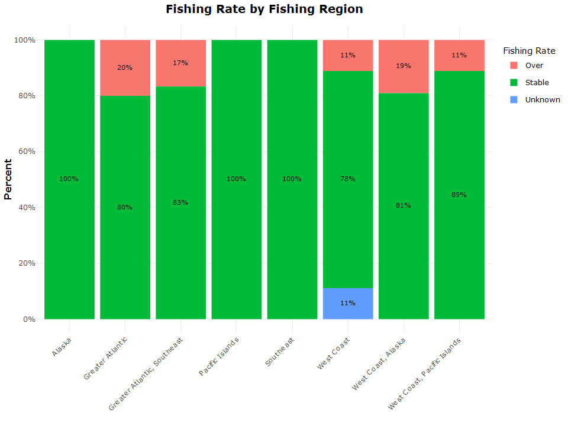
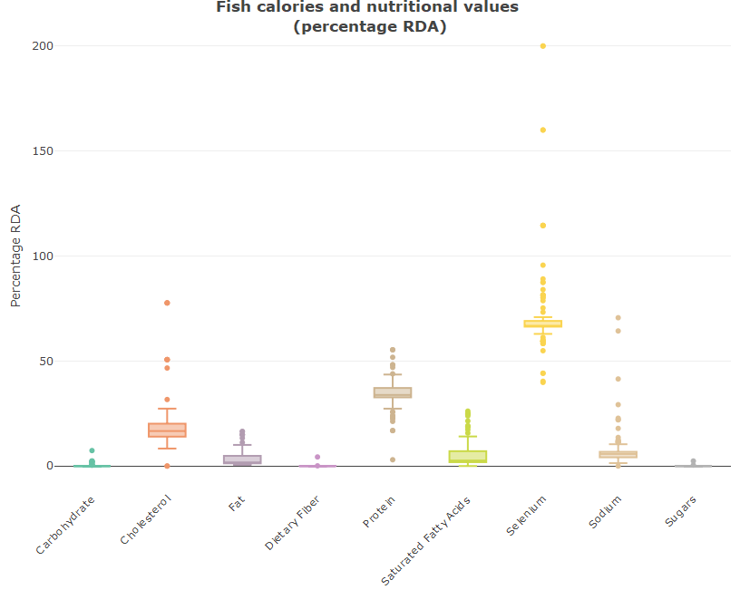

# Seafood: The Ultimate Food 🐟?

As more people are opting against red meat diet for plant based and sea
food, this might be a good time to analyze aquatic food sources. The
[environmental
impact](https://www.greenpeace.org.uk/news/why-meat-is-bad-for-the-environment/#:~:text=It%20causes%20climate%20change,the%20atmosphere%2C%20accelerating%20global%20warming)
of industrialized red meat production and [health
concerns](https://www.nytimes.com/2019/09/30/health/red-meat-heart-cancer.html)
has made sea food a favourable alternative diet also termed as
[“pescatarian
diet”](https://www.medicalnewstoday.com/articles/323907#:~:text=What%20is%20a%20pescatarian%20diet%3F&text=In%20the%20pescatarian%20diet%2C%20a,and%20fish%20products%20may%20enhance).

This project looks to answer two thing:

1.  Is seafood environmentally sustainable?
2.  Does it pack the nutrients to replace red meat diet?

###  The full project with **code** can be found [here.](https://github.com/rickyboshe/Fisheries/blob/main/Fisheries/Fisheries.md)

#  Summary
According to the data from
[National Oceanic and Atmostpheric Administration
(NOAA)](https://www.fishwatch.gov/resources) seafood fishing has been mostly within recommended levels across fishery regions in the US.

  

The majority of fishing regions are experiencing stable fishing rates,
well within recommended levels for existing populations. The Greater
Atlantic fishing zone has the highest levels of over fishing as compared
to the other regions (20%).

As some private companies are also embarking on fish farming to preserve communities, some of the species have been observed to have a net benefit to the environment. 

|                                                         Blue Mussel                                                         |                                                                                                                                                          Sable Fish                                                                                                                                                          |
| :-------------------------------------------------------------------------------------------------------------------------: | :--------------------------------------------------------------------------------------------------------------------------------------------------------------------------------------------------------------------------------------------------------------------------------------------------------------------------: |
|        |                                                                                                                                                                                             |
| The blue mussel has been observed to have a net benefit on the environment while boasting rich levels of protein (21% RDA). | The sable fish is available year round and is a great source for protein (24% RDA), low on carbs (0% RDA) and sodium (4% RDA). But the species is under monitoring from federal and state authorities to ensure its fishing has minimal impact on the environment. It also has relatively high levels of selenium (66% RDA). |

When it comes to nutriotion and calories of seafood, It looks like most fish species are rich in protein, selenium and
cholesterol. With the exception of Atlantic Bigeye Tuna and Pacific Blue
Marin, all fish species have nutrients that are within the recommended
dietary allowance in the USA.

All species show very low amounts of sugars, fat and saturated fatty
acids, which is good for heart health. For anyone looking for a low carb
diet, fish is the answer. They have very low carbohydrate per serving.

Futher analysis, including responsive charts can be found here.
